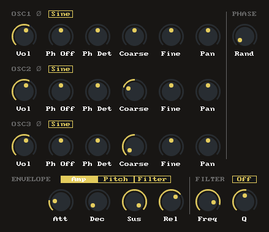

# JS3Osc

JSFX polyphonic synth based of IL 3xOsc.

Features:
* Polyphonic voicing
* Filter, pitch and amplitude envelopes per voice
* Three oscillators with 6 wave types
* Oscillator phase stereo detuning and offset

Available on ReaPack